# System Architecture

> Self-Evolving Skill Gap Analyzer and Guidance System

This document describes the architecture of the backend and its connections to the frontend, Agent-Runtime, and Advanced-Recommendation-System. All diagrams use Mermaid syntax.

## Table of Contents

- [High-Level System Overview](#high-level-system-overview)
- [Service Communication Architecture](#service-communication-architecture)
- [Backend Internal Architecture](#backend-internal-architecture)
- [Request Flow: Skill Gap Analysis](#request-flow-skill-gap-analysis)
- [Self-Evolving Feedback Loop](#self-evolving-feedback-loop)
- [Training Data Pipeline](#training-data-pipeline)
- [Frontend Architecture](#frontend-architecture)
- [Data Model](#data-model)
- [Knowledge Graph Schema](#knowledge-graph-schema)
- [Recommendation Engine Internals](#recommendation-engine-internals)
- [Agent-Runtime Pipeline](#agent-runtime-pipeline)
- [Deployment Architecture](#deployment-architecture)

---

## High-Level System Overview

The system follows a microservice architecture with the backend acting as the central API gateway. The frontend communicates exclusively with the backend, which orchestrates calls to specialized services.

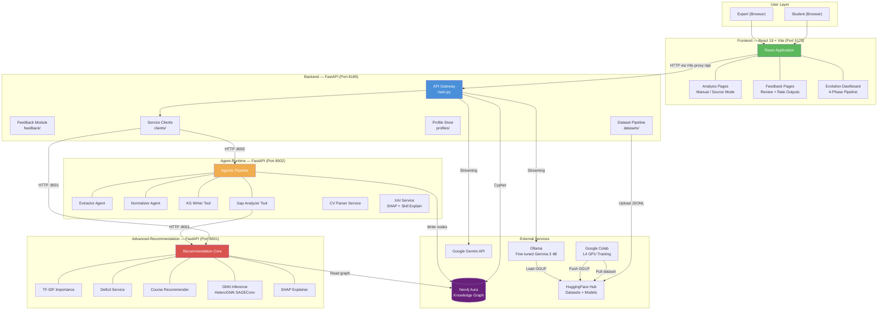

---

## Service Communication Architecture

Detailed view of inter-service HTTP communication with specific endpoints.

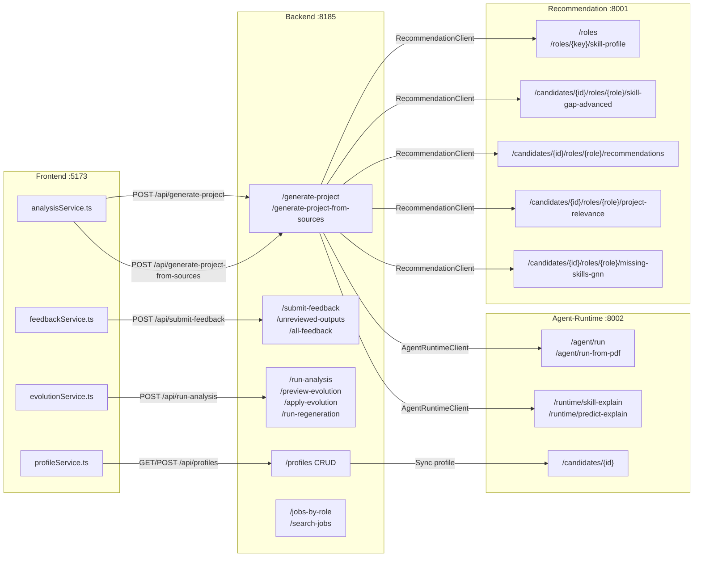

---

## Backend Internal Architecture

The backend's internal module structure and data flow.

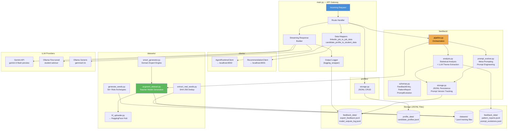

---

## Request Flow: Skill Gap Analysis

Sequence diagram showing the complete flow for the orchestrated `/generate-project-from-sources` endpoint.

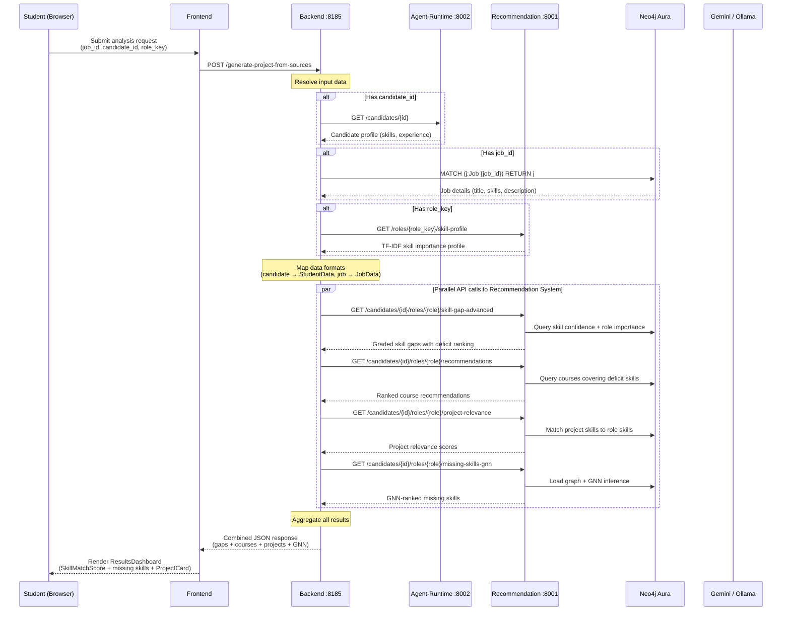

---

## Self-Evolving Feedback Loop

The 4-phase continuous improvement cycle that distinguishes this system.

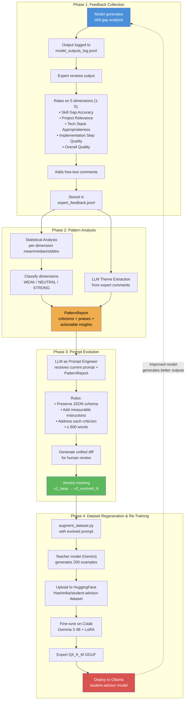

### Prompt Version Lineage

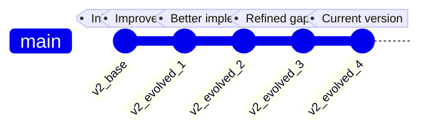

---

## Training Data Pipeline

End-to-end flow from seed generation through model deployment.

```mermaid
flowchart LR
    subgraph "Seed Sources"
        SYN["generate_seeds.py<br/>50+ role archetypes<br/>(nurse, pilot, chef, ...)"]
        REAL["extract_real_seeds.py<br/>From actual user sessions<br/>SHA-256 dedup"]
    end

    subgraph "Enrichment"
        SMART["smart_generator.py<br/>Domain Expert Engine"]
        SMART_D["Maps backgrounds to:<br/>• Curated skill gaps<br/>• Project titles<br/>• Tech stacks<br/>• Implementation plans"]
    end

    subgraph "Generation"
        AUG["augment_dataset.py"]
        PROMPT["Constructs prompt with:<br/>• System prompt (evolved)<br/>• Seed profile<br/>• Smart generator context"]
        TEACHER["Teacher Model<br/>Gemini / Ollama"]
    end

    subgraph "Dataset"
        V1["V1 Dataset (text format)<br/>student_advisor_dataset_v1"]
        V2["V2 Dataset (JSON format)<br/>student_advisor_dataset_v2"]
        HFU["hf_uploader.py"]
        HFR["HuggingFace Hub<br/>Hashinika/student-advisor-dataset"]
    end

    subgraph "Training (Colab)"
        NB1["V1 Notebook<br/>Markdown output model"]
        NB2["V2 Notebook<br/>JSON output model"]
        LORA["LoRA Config:<br/>r=64, alpha=64<br/>119M / 4.4B params (2.7%)"]
        SFT["SFTTrainer<br/>1 epoch, 20 steps<br/>lr=2e-4, batch=8"]
    end

    subgraph "Deployment"
        GGUF["Q4_K_M GGUF<br/>~2.49 GB"]
        HFM["HuggingFace Hub<br/>Hashinika/gemma-3-4b-<br/>student-advisor-*-GGUF"]
        OLLAMA["Ollama<br/>student-advisor"]
    end

    SYN --> SMART
    REAL --> SMART
    SMART --- SMART_D
    SMART_D --> AUG
    AUG --- PROMPT --> TEACHER
    TEACHER --> V1 & V2
    V1 --> HFU
    V2 --> HFU
    HFU --> HFR
    HFR --> NB1 & NB2
    NB1 & NB2 --- LORA --- SFT
    SFT --> GGUF --> HFM --> OLLAMA

    style AUG fill:#5cb85c,color:#fff
    style SFT fill:#4a90d9,color:#fff
    style OLLAMA fill:#d9534f,color:#fff
```

### Domain Expert Mappings (smart_generator.py)

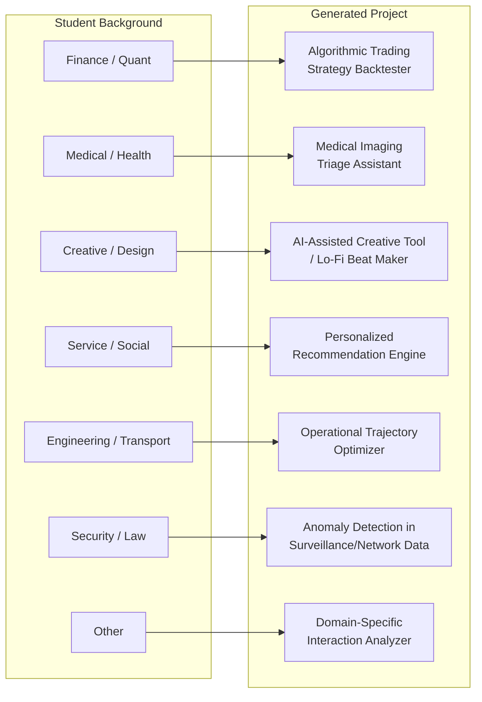

---

## Frontend Architecture

The React frontend structure, focusing on how it interacts with the backend.

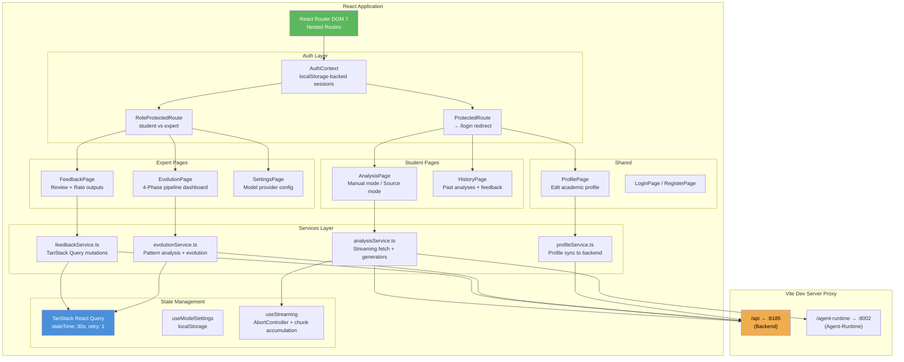

### Frontend Output Parsing

The frontend handles two distinct LLM output formats:

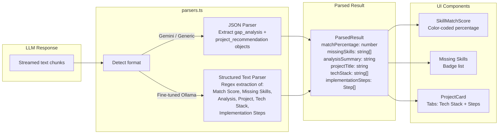

---

## Data Model

### Pydantic Schemas (Backend)

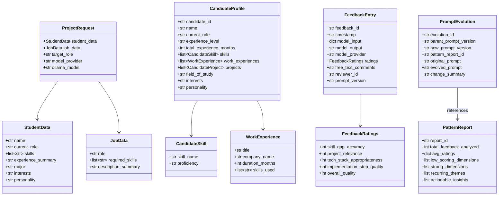

---

## Knowledge Graph Schema

The Neo4j knowledge graph shared across all services.

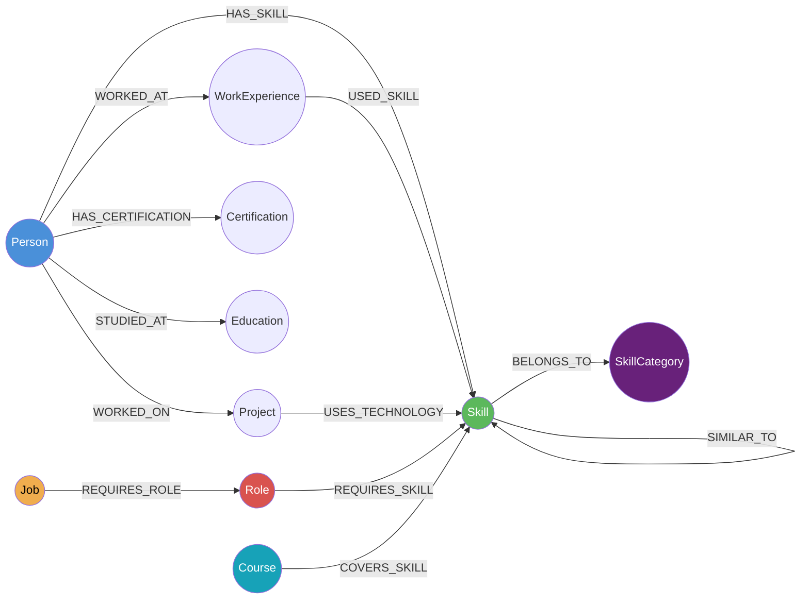

**Node Properties:**

| Node | Key Properties |
|------|---------------|
| `Person` | candidate_id, name, current_role, experience_level, total_experience_months |
| `Skill` | name, category |
| `WorkExperience` | title, company_name, duration_months |
| `Project` | name, description |
| `Certification` | name |
| `Education` | institution, field_of_study, degree |
| `Job` | job_id, title, company_name, location, role_key, description, job_url |
| `Role` | role_key, name |
| `SkillCategory` | name |
| `Course` | title, provider, rating, url |

**Relationship Weights (Evidence for Skill Confidence):**

| Relationship | Weight | Meaning |
|-------------|--------|---------|
| `USED_SKILL` (WorkExperience) | 0.90 | Used professionally in a job |
| `USES_TECHNOLOGY` (Project) | 0.80 | Applied in a personal/academic project |
| `HAS_SKILL` (Person) | 0.70 | Self-declared on CV |
| `HAS_CERTIFICATION` | 0.60 | Formal certification |

Skill confidence uses the noisy-OR formula: `P(has_skill) = 1 - product(1 - weight_i)` across all evidence sources.

---

## Recommendation Engine Internals

How the Advanced-Recommendation-System computes skill gaps and rankings.

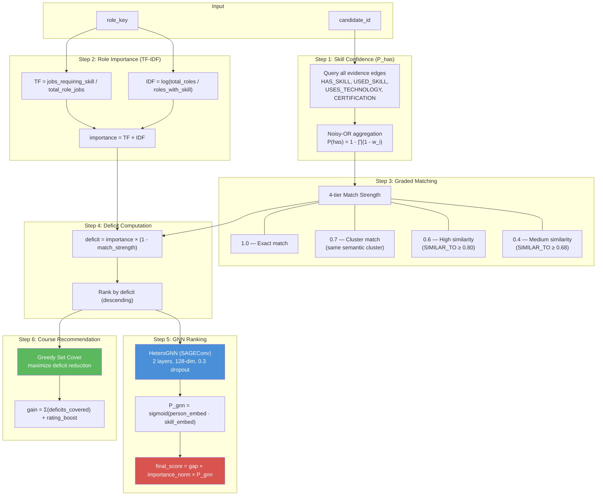

---

## Agent-Runtime Pipeline

The 4-agent pipeline that processes CVs and writes to the knowledge graph.

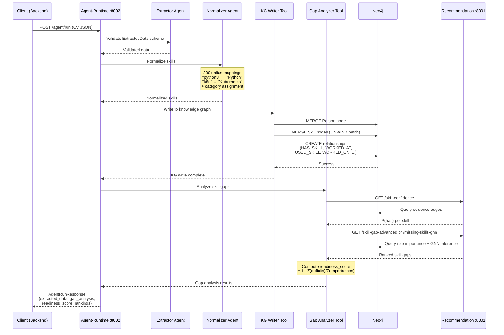

### PDF Upload Flow

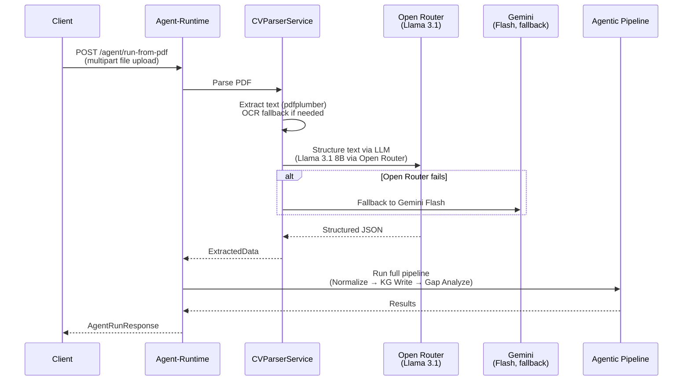

---

## Deployment Architecture

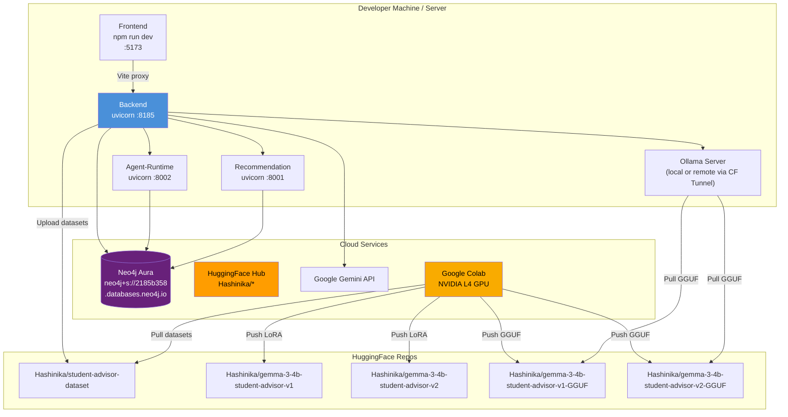
